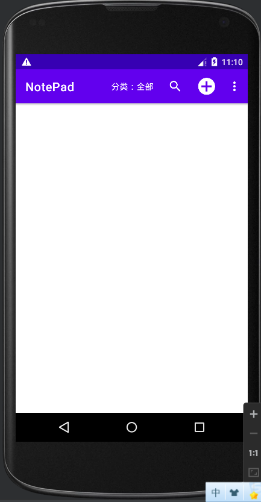
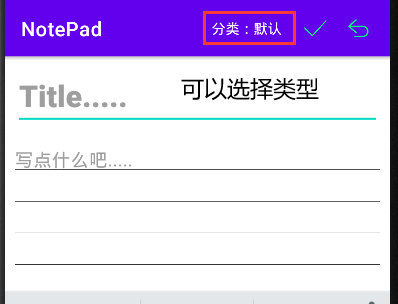
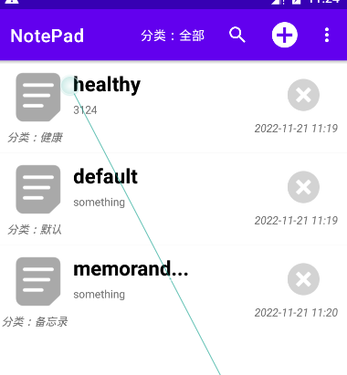
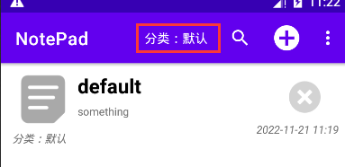
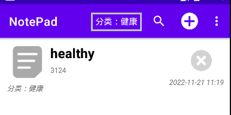
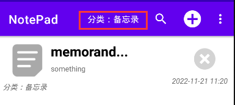
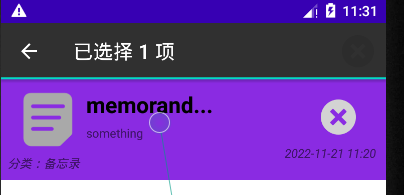
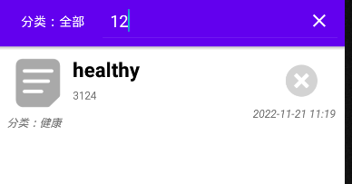

# NotePad

1.刚刚打开项目的样式



2.点击加号可以添加标签(分类有：默认，健康，备忘录，三种可以进行选择)



3.点击对勾之后可以保存,返回之后可以看到相应的结果（这里已经添加了三条数据）



4.通过上面的分类选择可以，筛选对应的分类








分类赛选代码：

```java
//清除列表
lv_index.setAdapter(null);

//载入数据库
loadDB();

//生成表
String create_table = "create table if not exists notepad(" +
        "id integer primary key," +
        "note_title text," +
        "note_text text," +
        "note_tag text default '默认'," +
        "note_time datetime," +
        "background_color integer)";
db.execSQL(create_table);


//构造组件映射列表
ArrayList<HashMap<String, Object>> list = new ArrayList<HashMap<String, Object>>();

//查找并装配
String sql = "select * from notepad;";

//重载关键字
if (keyword != null)
    sql = "select * from notepad where note_title like '%" + keyword + "%'" +
            " or note_text like '%" + keyword + "%'" +
            " or note_tag like '%" + keyword + "%';";

Cursor result = db.rawQuery(sql, null);
while (result.moveToNext())
{
    //获取参数列
    int idColumn = result.getColumnIndex("id");
    int titleColumn = result.getColumnIndex("note_title");
    int textColumn = result.getColumnIndex("note_text");
    int timeColumn = result.getColumnIndex("note_time");
    int tagColumn = result.getColumnIndex("note_tag");

    //设置映射
    HashMap<String, Object> mp = new HashMap<String, Object>();
    mp.put("tv_id", result.getInt(idColumn));
    mp.put("iv_icon", R.drawable.icon_notepad);

    //过滤标题
    String title = result.getString(titleColumn);
    if (title.length() > 8)
        title = title.substring(0, 8) + "...";

    mp.put("tv_title", title);

    //过滤文本
    String text = result.getString(textColumn);
    if (text.length() > 20)
        text = text.substring(0, 20) + "...";

    mp.put("tv_text", text);
    mp.put("tv_time", result.getString(timeColumn));
    mp.put("tv_tag", "分类：" + result.getString(tagColumn));

    list.add(mp);
```

5.长按可以对选项进行选择，然后进行操作



6.可以通过按内容进行查询

